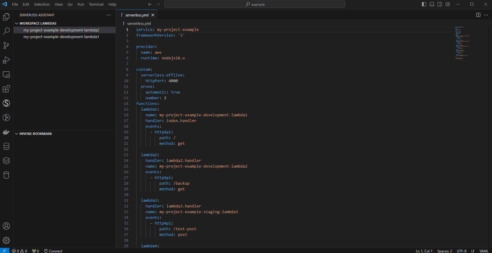
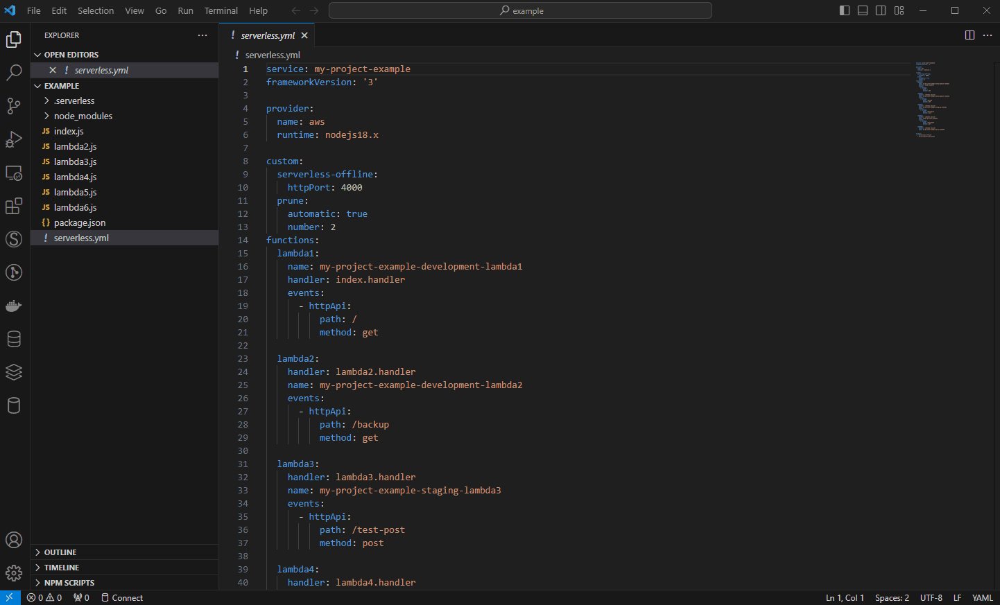
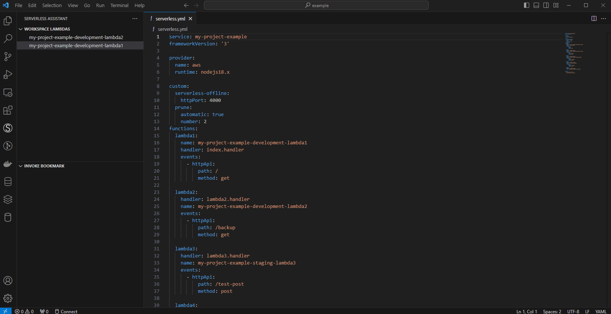
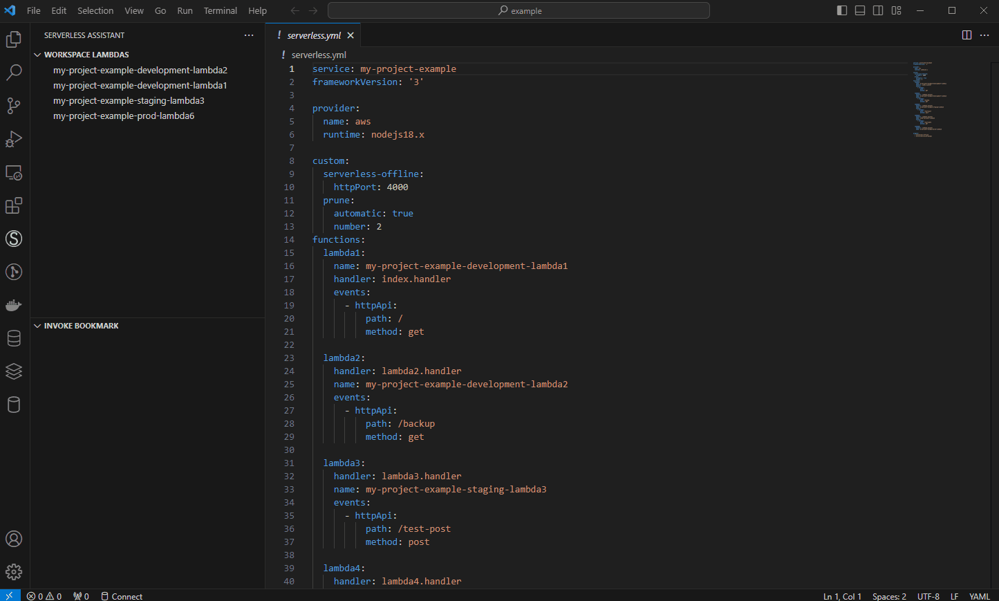
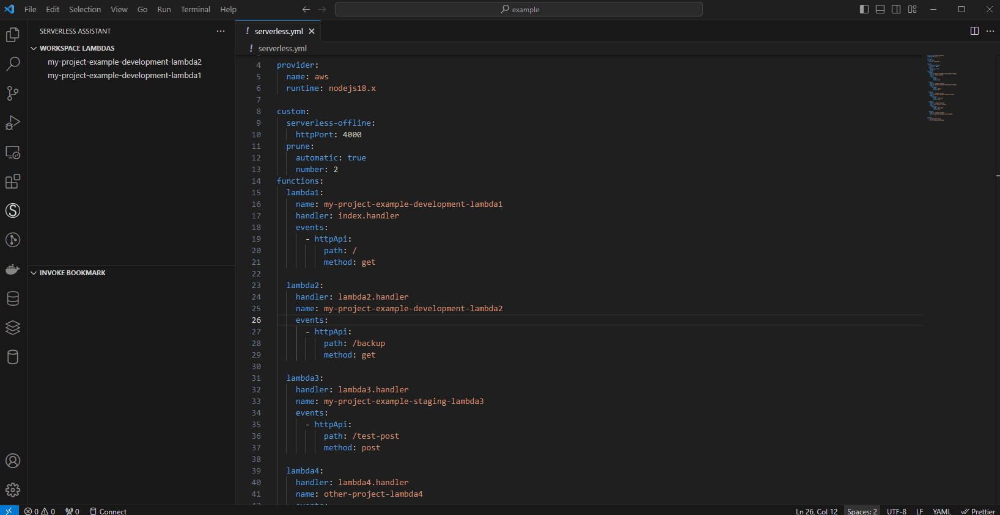

## Serverless Assistant extension

Serverless Assistant is a simple extension for serverless framework developers, designed to integrate invocation, deployment, and real-time log monitoring into your VS Code workflow. Whether you're working with local serverless-offline invocations or managing AWS Lambdas, Serverless Assistant simplifies your development process.

Key Features:

* Effortless Invocation:

Invoke your Lambdas directly from VS Code, saving up to three payloads for quick access.

Perform local invocations using the serverless-offline plugin for streamlined development.

Utilize the bookmark view to invoke any Lambda from your AWS profile, regardless of naming conventions.

* Simplified Deployment:

Effortlessly deploy your serverless applications directly from VS Code, streamlining your development workflow.

* Real-time Log Monitoring:

Stay informed with real-time log monitoring, allowing you to debug and troubleshoot your applications in real time.

* Lambda Information:

Access lambda details, including the date of the last deployment, lambda size, and all associated tags.

Demo:

## Requirements

You must have aws credentials configured in your operating system with right permissions to access and deploy your lambdas. You also should have serverless cli and aws cli v2.

[AWS CLI - https://docs.aws.amazon.com/cli/latest/userguide/getting-started-install.html](https://docs.aws.amazon.com/cli/latest/userguide/getting-started-install.html)

[Serverless - https://www.serverless.com/framework/docs/getting-started](https://www.serverless.com/framework/docs/getting-started)

### Install

This extension search for lambdas in your account and filter considering you have a prefix name for your workspace. If you don´t have prefix keep field empty to retrieve all lambdas. You should also inform your profile name and aws region. 

## Extension Settings

### Deploy and Invoke Local

To deploy and invoke local you need to add manually the name defined in functions section of your serverless yaml file. 

### Stage Support

To use this feature you should follow namming pattern in this way: {prefix}-{stage}-lambdaName.

### Bookmark and Invoking lambdas out of your workspace

You can use Bookmark view to invoke lambdas out of your workspace scope. Using add button is possible to search all over your profiles lambdas.

### Change Profile

At settings pages you can add or remove profiles. It must match with your aws credentials files. We save your invoke payload historic based on your profile, so if you want keep your payload, update profile name instead of remove. 

