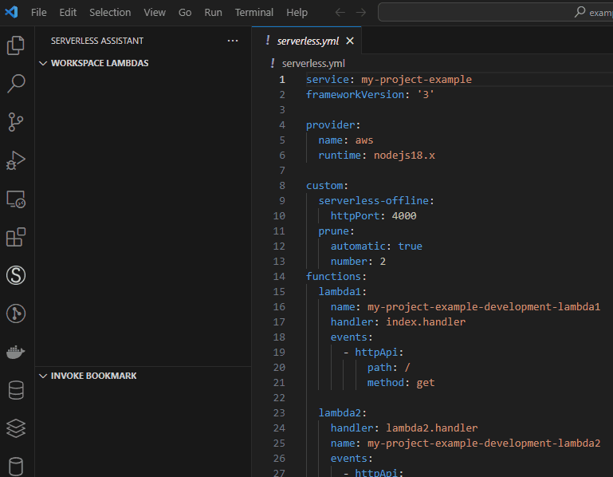

## Serverless Assistant extension

This extesion helps you to invoke, watch logs and deploy your lambdas.

## Requirements

You must have aws credentials configured in your operating system with right permissions to access and deploy your lambdas. You also should have serverless cli and aws cli v2.

### Install

This extension search for lambdas in your account and filter considering you have a prefix name for your workspace. If you don´t have prefix keep field empty to retrieve all lambdas. You should also inform your profile name and aws region. 

## Extension Settings

### Deploy and Invoke Local

To deploy and invoke local you need to add manually the name defined in functions section of you serverless yaml file. 

### Stage Support

To use this feature you should follow namming pattern in this way: {prefix}-{stage}-lambdaName.

### Change Profile

At settings pages you can add or remove profiles. It must match with your aws credentials files. We save your invoke payload historic based on your profile, so if you want keep data update profile name instead of remove and add a new one. 

